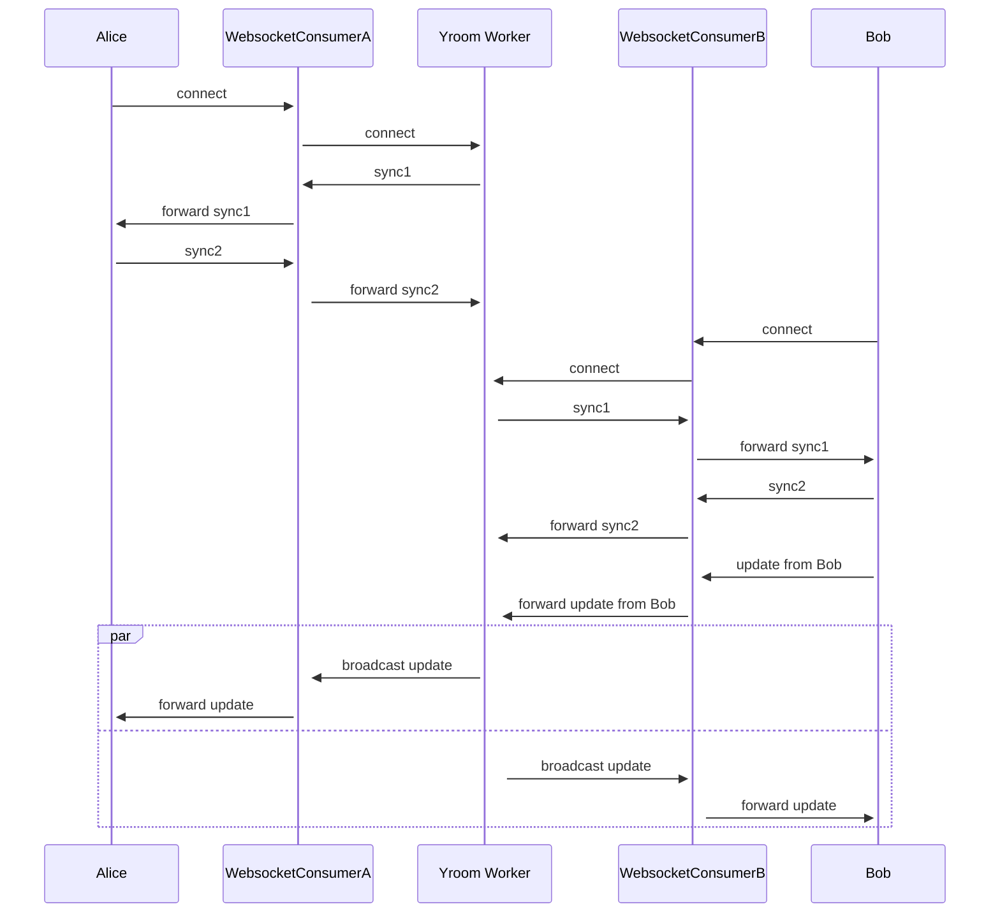

# Channels-Yroom

`channels-yroom` is a Django Channels WebSocket consumer and worker for synchronizing Yjs clients. It implements the network protocol for Yjs doc synchronization and awareness updates and makes them available as Django Channels WebSocket consumer and worker.

## Get started

1. Install:

    `pip install channels-yroom`

2. Add `channels` and `channels_yroom` to `INSTALLED_APPS` in your settings.

3. Set up your WebSocket consumer in `consumers.py`.

   ```python

    from channels_yroom.consumer import YroomConsumer

    class TextCollaborationConsumer(YroomConsumer):
        room_name_prefix: str = "yroom"
        room_url_kwargs: str = "room_name"

        # or

        def get_room_group_name(self) -> str:
            """
            Determine a unique name for this room, e.g. based on URL
            """
            room_name = self.scope["url_route"]["kwargs"]["room_name"]
            return "textcollab_%s" % room_name


        # use hooks or override the default

        # hook:

        async def pre_connect(self) -> None:
            user = self.scope["user"]
            if not user.is_staff:
                await self.close()

        # override the default
        async def connect(self) -> None:
            """
            Optional: perform some sort of authentication
            """
            user = self.scope["user"]
            if not user.is_staff:
                await self.close()
                return

            await super().connect()
    ```

4. Hook your WebSocket patterns in your `asgi.py` and add a `"channel"` protocol router for the `"yroom"` channel name:

    ```python
    # ...
    application = ProtocolTypeRouter(
        {
            "http": get_asgi_application(),
            "websocket": AllowedHostsOriginValidator(
                AuthMiddlewareStack(URLRouter(textcollab.routing.websocket_urlpatterns))
            ),
            "channel": ChannelNameRouter(
                {
                    "yroom": YRoomChannelConsumer.as_asgi(),
                }
            ),
        }
    )
    ```

5. In addition to your webserver with WebSockets support (e.g. daphne or uvicorn), you need to run a [channels worker](https://channels.readthedocs.io/en/stable/topics/worker.html). You can run the `yroom` worker implementation that supports graceful shutdown:

    ```sh
    python manage.py yroom
    ```


## Showcase: text collaboration example

The `example` folder contains a simple project that uses `y-prosemirror` to allow for realtime collaboration on rich text.

Run the included Docker compose file to check it out:

```sh
docker compose up
# Then visit localhost:8000
```


## How it works

Yjs clients connect via WebSockets to a Channels WebSocket Consumer which can perform e.g. authentication and then forwards messages via channel layer to a central worker. This worker runs in a separate process and keeps a Yjs document + awareness information for each 'room', processes synchronization and awareness updates and sends responses (single and broadcast to room) to the WebSocket consumers.

Under the hood, this project uses [`yroom`](https://github.com/stefanw/yroom/) which is high-level Python binding to a Yjs synchronization and awareness implementation in Rust based on the [official Yjs Rust port](https://github.com/y-crdt).


### Example flow




### Consumer Hooks

These hooks are called at the times described (pre and post) when the consumer events of the channel library are executed.

```py
class YRoomConsumerHooks:
    async def pre_connect(self):
        pass

    async def post_connect(self):
        pass

    async def pre_disconnect(self):
        pass

    async def post_disconnect(self):
        pass

    async def pre_receive(self, text_data: Optional[str] = None, bytes_data: Optional[bytes] = None
    ) -> None:
        pass

    async def post_receive(self, text_data: Optional[str] = None, bytes_data: Optional[bytes] = None
    ) -> None:
        pass
```