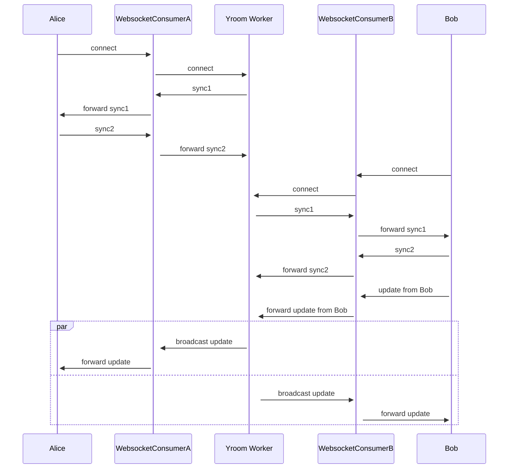

# How it works

Yjs clients connect via WebSockets to a Channels WebSocket Consumer which can perform e.g. authentication and then forwards messages via channel layer to a central worker. This worker runs in a separate process and keeps a Yjs document + awareness information for each 'room', processes synchronization and awareness updates and sends responses (single and broadcast to room) to the WebSocket consumers.

Under the hood, this project uses [`yroom`](https://github.com/stefanw/yroom/) which is a high-level Python binding to a Yjs synchronization and awareness implementation in Rust based on the [official Yjs Rust port](https://github.com/y-crdt).

## Example flow

